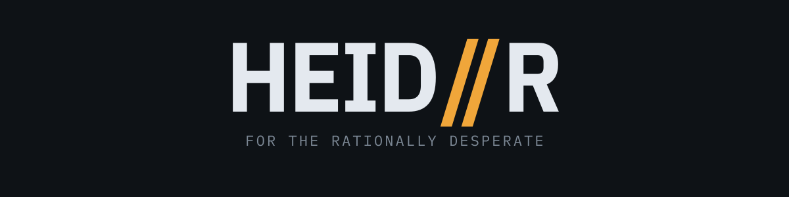

<p align="center">
  
</p>

<p align="center">
  
  
  
  
</p>

A modal terminal program that answers a question with something it finds rather
than with something it writes. The material comes from radio noise, from an
aircraft passing overhead, from the last earthquake, from a page of the Library
of Babel. A local language model may interpret what was found. It never chooses
it, and the program never claims the coincidence means anything on its own.

Named after Heiðr, the völva of the *Völuspá*, who was burned three times and
born three times, and who travelled between farms telling people what was
coming. The name is the theme; the machinery underneath is ordinary software.

> Documentation: [English](docs/en/README.md) · [Русский](docs/ru/README.md)

## A run has three slots

```
question ──> [question module] ──> Key ──> [source] ──> Material ──> [reading] ──> answer
```

One module is chosen at random for each slot before every run, so the chain
differs each time. The choice is seeded from measurements rather than from a
pseudo random generator: radio noise, a public randomness beacon, the Merkle
root of a recent block. Ten question modules, fourteen sources and six readings
make 840 distinct chains. The interface calls a chain a "rite", and so does the
code (`Rite`).

The ledger records the question before anything is fetched, and each entry is
sealed against the one before it. A question that was answered cannot be asked
again until the next day; a question that was not answered costs nothing.

A module can have no answer today. The feed may be unreachable, the reply may
not parse, the model may return an empty string. None of that ends the run: the
slot picks another module and the panel says which one gave way to which.

## Modules

Nothing here is required. A module whose needs are unmet is left out of the
choice, and `:checkhealth` says what is missing.

### Question modules: what the question becomes

| Module | Needs | What it does |
|---|---|---|
| [gematria](docs/en/modules/gematria.md) | — | Letters become numbers, and their sum is the key |
| [skeleton](docs/en/modules/skeleton.md) | — | Vowels are dropped; the consonant root remains |
| [acrostic](docs/en/modules/acrostic.md) | — | The first letters of the words, read as one word |
| [rarest](docs/en/modules/rarest.md) | — | The least ordinary word becomes the only anchor |
| [blind](docs/en/modules/blind.md) | — | Only the question's length is used. Double blind |
| [moment](docs/en/modules/moment.md) | — | The question is ignored; the hour and the moon decide |
| [calendar](docs/en/modules/calendar.md) | — | Today in the Discordian, Republican or Maya reckoning |
| [planetary](docs/en/modules/planetary.md) | position | The planet ruling this hour, by the Chaldean order |
| [reversal](docs/en/modules/reversal.md) | `llm` | A model rewrites the question as its opposite |
| [embed](docs/en/modules/embed.md) | `llm` | The question as a vector, folded into a number |

### Sources: where the material comes from

| Module | Needs | What it does |
|---|---|---|
| [mojibake](docs/en/modules/mojibake.md) | — | Random bytes read through the wrong code page |
| [babel](docs/en/modules/babel.md) | — | A page of the Library of Babel, by invertible bijection |
| [quake](docs/en/modules/quake.md) | `net` | An earthquake from the last hour |
| [chain](docs/en/modules/chain.md) | `net` | A block's Merkle root, and what people wrote into it |
| [sky](docs/en/modules/sky.md) | `net` | An aircraft overhead, through a public receiver network |
| [sdr_noise](docs/en/modules/sdr_noise.md) | `sdr` | The noise floor of an empty frequency, debiased |
| [rtl_peak](docs/en/modules/rtl_peak.md) | `sdr` | The loudest unidentified signal in a band |
| [ism](docs/en/modules/ism.md) | `sdr` | The neighbours' weather stations and doorbells |
| [adsb_local](docs/en/modules/adsb_local.md) | `sdr` | An aircraft overhead, on your own antenna |
| [hline](docs/en/modules/hline.md) | `sdr` | The hydrogen line at 1420 MHz, and its Doppler shift |
| [apt](docs/en/modules/apt.md) | `sdr` | A weather satellite pass, decoded into a picture |
| [fm_voice](docs/en/modules/fm_voice.md) | `sdr` `stt` | Real FM stations, recorded and transcribed |
| [sw_voice](docs/en/modules/sw_voice.md) | `sdr` `stt` | Shortwave in AM, where the recogniser starts inventing |
| [mw_voice](docs/en/modules/mw_voice.md) | `sdr` `stt` | Medium wave, where at night the station is far away |

### Readings: what the material becomes

| Module | Needs | What it does |
|---|---|---|
| [cutup](docs/en/modules/cutup.md) | — | Burroughs' method, with no model involved at all |
| [oblique](docs/en/modules/oblique.md) | — | One terse instruction, and nothing else |
| [iching](docs/en/modules/iching.md) | — | A real Da Yan casting, not a coin toss |
| [tarot](docs/en/modules/tarot.md) | — | A spread dealt from the material, not from chance |
| [mute](docs/en/modules/mute.md) | — | Returns nothing on purpose; the material stands on its own |
| [pythia](docs/en/modules/pythia.md) | `llm` | A model interprets, in a voice picked at random too |

## What each capability needs

| Capability | Needs | Without it |
|---|---|---|
| `net` | A working network | Three sources are left out |
| `sdr` | An RTL-SDR dongle, and `rtl_sdr`, `rtl_fm`, `rtl_power`; `rtl_433` and `dump1090` for two of them; `noaa-apt` for one | Nine sources are left out |
| `stt` | [vosk](https://github.com/alphacep/vosk-api) or a built [whisper.cpp](https://github.com/ggml-org/whisper.cpp) with a model | No voice input and no radio transcription |
| `llm` | A reachable ollama, llama.cpp server, or an API key | Three modules are left out |
| `audio` | `sounddevice` and an output device | The program runs silently |

With none of them, `gematria//babel//iching` still works and asks nothing of the
outside world.

## Install

Python 3.11 or newer, and a terminal from this century. What each system needs,
and what does not work where, is in [docs/en/install.md](docs/en/install.md).

### Linux

```
pip install -e '.[audio]'
heidr
```

Everything works here: radio, sound, speech, local models. The receiver needs
`rtl-sdr` from your package manager.

### macOS

The same, natively. Nothing needs emulating.

```
brew install rtl-sdr ollama
pip install -e '.[audio]'
```

### Windows

Use Windows Terminal, not the old console host. Everything works except the
receiver: `numpy` and `sounddevice` install from wheels, ollama has its own
build, and Windows Terminal understands the escape sequence `y` uses to copy.

```
py -m pip install -e ".[audio]"
py -m heidr
```

The dongle is the exception. A USB device reaches a Linux driver only through
WSL2, with [usbipd-win](https://github.com/dorssel/usbipd-win) forwarding it;
inside WSL2 the radio then behaves as it does on Linux.

Optional extras everywhere: `pip install -e '.[audio,vosk,effects]'`

### As one file

There is a PyInstaller recipe, for a machine where nothing should be installed:

```
python -m venv build-env
build-env/bin/pip install pyinstaller '.[audio,effects]'
build-env/bin/pyinstaller heidr.spec
```

`dist/heidr` is then a single executable of about 37 MB carrying Python and
every dependency. The external programs stay external: `rtl_fm`, `whisper-cli`
and the rest are run as subprocesses, so they are found on the path or the
capability is simply absent, exactly as with an ordinary install.

## Configure

```
cp config.example.toml ~/.config/heidr/config.toml
cp keymap.example.toml ~/.config/heidr/keymap.toml
```

API keys are read only from environment variables, never from the config file.
See `.env.example`.

## Use

The program opens in a menu. Each entry shows the command and the key that do
the same thing, so the controls are read off the screen rather than learned from
a manual. Arrows or `j` and `k` move, `Enter` chooses, `Esc` goes back a level,
the mouse works, and `ui.splash=false` drops the wordmark above the list.

The keys are vim's, with a familiar second name beside each one: `F1` for help,
`Home` and `End` for the ends of a list, `Insert` to start typing, `Ctrl-S` to
save, `Ctrl-Z` to undo, `Ctrl-C` to stop or leave.

For vim hands: `i a A I o O` all open the question field, `gg` and `G` jump
to the ends, `Ctrl-D` and `Ctrl-U` move half a screen, `{` and `}` walk the
groups of settings, `/` searches with `n` and `N`, `y` copies, `u` takes a
setting back, `ZZ` saves and leaves. The whole map, and the five places where
this and vim cannot agree, is in [docs/en/keys.md](docs/en/keys.md).

Modal, in the manner of neovim. `:ask` puts a question, `Ctrl-V` in insert mode
dictates it instead. Up and down, or `Ctrl-P` and `Ctrl-N`, bring back what was
typed before; commands and questions are kept in two files under
`~/.local/share/heidr` and looked through apart. `:modules` lists what is
available and why, `:settings` edits every option there is, `:ledger` reads past
runs, `:checkhealth` explains what is missing, `:w` saves, `:q` leaves.

The chain can also be named instead of picked: `:draw rarest//babel//iching`,
with `*` for any slot left to chance, or the same thing chosen from the menu one
slot at a time. A named chain is marked `(chosen)` in the ledger, and it is
exempt from the one answer a day rule: putting the same question to several
chains is an experiment, and the mark keeps the two apart.

Every stage brings its own animation, and adding one is a single file too:
see [docs/en/animations.md](docs/en/animations.md).

Adding a module is one file: see [docs/en/module-guide.md](docs/en/module-guide.md).
Dropping that file into `~/.config/heidr/modules/` is enough, and the core is
never edited.

## Credits

`HEID//R` borrows code and ideas from other people's work. Each module documents
its own sources; the full table lives in [docs/en/credits.md](docs/en/credits.md).

Code adapted: [rtl-entropy](https://github.com/pwarren/rtl-entropy) (GPL-3.0),
[drawille](https://github.com/asciimoo/drawille) (GPL-3.0),
[no-more-secrets](https://github.com/bartobri/no-more-secrets) (GPL-3.0),
[gqrx-ghostbox](https://github.com/DougHaber/gqrx-ghostbox) (ISC),
[dreamdir](https://github.com/sobjornstad/dreamdir) (MIT).

## Tests

```
pytest              # everything that needs no hardware and no network
pytest -m live      # the rest
python tools/check_docs.py
```

## License

GPL-3.0-or-later. See [LICENSE](LICENSE).
