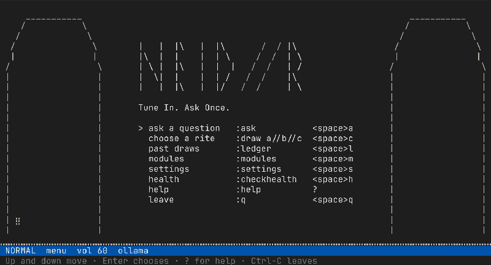
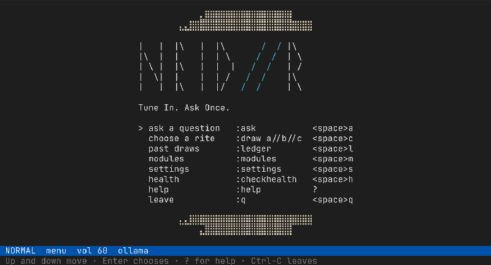

<p align="center">
  
</p>

<p align="center">
  
  
  
  
</p>

<p align="center"><a href="README.md">In English</a></p>

<p align="center">
  <picture>
    <source srcset="docs/demo/menu.webp" type="image/webp">
    
  </picture>
</p>

Терминальный оракул, который не отвечает на вопрос сочинённым
текстом, а "извлекает ответ из мировой энтропии". 
Материал извлекается из радиошума, из данных о самолетах, пролетающих
над головой, из последнего землетрясения, из страницы Вавилонской библиотеки.
Языковая модель может истолковать найденное, но не выдумать с нуля.

Название отсылается к Хейд - вёльве из «Прорицания вёльвы»: её трижды сжигали и трижды
она рождалась заново. Она ходила по дворам, рассказывая людям, что их ждёт.

> Документация: [русская](docs/ru/README.md) · [английская](docs/en/README.md)

## В прогоне три слота

```
вопрос ──> [модуль вопроса] ──> Key ──> [источник] ──> Material ──> [толкование] ──> ответ
```

Прогон — цепочка из трёх слотов. Первый превращает вопрос в ключ (`Key`),
второй по ключу добывает материал (`Material`), третий превращает материал в
текст ответа.

Модуль для каждого слота выбирается случайно перед запуском, так что цепочка
всякий раз другая: десять модулей вопроса, семнадцать источников и шесть
толкований дают 1020 сочетаний. Семя выбора берётся из измерений, а не из
псевдослучайного генератора: радиошум, публичный маяк случайности, корень
Меркла свежего блока. В коде цепочка называется `Rite`, на экране — «обрядом».

Журнал записывает вопрос до того, как загружено хоть что-нибудь, и каждая
запись скрепляется хешем предыдущей. Вопрос, на который ответ уже получен,
повторно задать нельзя до следующего дня; вопрос, оставшийся без ответа, не
стоит ничего.

Источнику сегодня может быть нечего отдать: лента недоступна, в ответе нет
нужного поля, модель вернула пустую строку. Прогон на этом не заканчивается —
слот берёт следующий модуль, а панель показывает, кто кого заменил.

### Два прогона целиком

<p align="center">
  
</p>

`gematria//net_voice//cutup`. Вопрос превращается в число, число выбирает станции
из каталога на пятьдесят тысяч, с каждой снимается по нескольку секунд и
расшифровывается, а дальше работают ножницы Берроуза. Никакой модели здесь нет
вовсе.

<p align="center">
  
</p>

`blind//chain//pythia`. Используется только длина вопроса, материалом служат
корень Меркла свежего блока и надписи, которые люди в этот блок вписали, а
локальная модель всё это перечитывает.

Оба ролика записывает `tools/make_demo.py`, а как именно — написано в
[документе про анимации](docs/ru/animations.md#как-их-записывают).

## Модули

Обязательных здесь нет. Модуль, которому не хватает чего-то в системе, в выборе
не участвует, а `:checkhealth` печатает, чего именно не хватает.

### Модули вопроса: во что превращается вопрос

| Модуль | Нужно | Что делает |
|---|---|---|
| [gematria](docs/ru/modules/gematria.md) | — | Буквы становятся числами, их сумма — ключом |
| [skeleton](docs/ru/modules/skeleton.md) | — | Гласные отбрасываются, остаётся согласный костяк |
| [acrostic](docs/ru/modules/acrostic.md) | — | Первые буквы слов, прочитанные как одно слово |
| [rarest](docs/ru/modules/rarest.md) | — | Самое необычное слово становится единственным якорем |
| [blind](docs/ru/modules/blind.md) | — | Читается только длина вопроса. Двойной слепой метод |
| [moment](docs/ru/modules/moment.md) | — | Вопрос не читается: решают час и фаза луны |
| [calendar](docs/ru/modules/calendar.md) | — | Сегодняшний день по дискордианскому, республиканскому или майяскому счёту |
| [planetary](docs/ru/modules/planetary.md) | координаты | Планета, правящая этим часом, по халдейскому ряду |
| [reversal](docs/ru/modules/reversal.md) | `llm` | Модель переписывает вопрос наоборот |
| [embed](docs/ru/modules/embed.md) | `llm` | Вопрос как вектор, свёрнутый в число |

### Источники: откуда берётся материал

| Модуль | Нужно | Что делает |
|---|---|---|
| [mojibake](docs/ru/modules/mojibake.md) | — | Случайные байты, прочитанные не той кодовой страницей |
| [babel](docs/ru/modules/babel.md) | — | Страница Вавилонской библиотеки через обратимое отображение |
| [quake](docs/ru/modules/quake.md) | `net` | Землетрясение последнего часа |
| [chain](docs/ru/modules/chain.md) | `net` | Корень Меркла блока и то, что люди в него вписали |
| [sky](docs/ru/modules/sky.md) | `net` | Самолёт над головой, через публичную сеть приёмников |
| [sdr_noise](docs/ru/modules/sdr_noise.md) | `sdr` | Шумовой пол пустой частоты после дебиасинга |
| [rtl_peak](docs/ru/modules/rtl_peak.md) | `sdr` | Самый громкий неопознанный сигнал в диапазоне |
| [ism](docs/ru/modules/ism.md) | `sdr` | Соседские метеостанции и дверные звонки |
| [adsb_local](docs/ru/modules/adsb_local.md) | `sdr` | Самолёт над головой, на собственную антенну |
| [hline](docs/ru/modules/hline.md) | `sdr` | Линия водорода на 1420 МГц и её доплеровский сдвиг |
| [apt](docs/ru/modules/apt.md) | `sdr` | Пролёт метеоспутника, раскодированный в картинку |
| [fm_voice](docs/ru/modules/fm_voice.md) | `sdr` `stt` | Настоящие FM-станции, записанные и расшифрованные |
| [sw_voice](docs/ru/modules/sw_voice.md) | `sdr` `stt` | Короткие волны в AM, где распознаватель начинает выдумывать |
| [mw_voice](docs/ru/modules/mw_voice.md) | `sdr` `stt` | Средние волны, где ночью станция оказывается далёкой |
| [net_voice](docs/ru/modules/net_voice.md) | `net` `stt` | Случайные интернет-радиостанции, вовсе без донгла |
| [kiwi_voice](docs/ru/modules/kiwi_voice.md) | `net` `stt` | Чужой коротковолновый приёмник, взятый на одно место |
| [twitch_voice](docs/ru/modules/twitch_voice.md) | `net` `stt` | Живая трансляция, где говорят в камеру. Нужны свои ключи |

### Толкования: во что превращается материал

| Модуль | Нужно | Что делает |
|---|---|---|
| [cutup](docs/ru/modules/cutup.md) | — | Метод Берроуза, вообще без всякой модели |
| [oblique](docs/ru/modules/oblique.md) | — | Одно короткое указание и больше ничего |
| [iching](docs/ru/modules/iching.md) | — | Настоящий расклад Да Янь, а не подбрасывание монет |
| [tarot](docs/ru/modules/tarot.md) | — | Расклад сдаётся из материала, а не из генератора случайных чисел |
| [mute](docs/ru/modules/mute.md) | — | Намеренно не выдаёт ни строки: остаётся только материал |
| [pythia](docs/ru/modules/pythia.md) | `llm` | Толкует модель — голосом, который тоже выбран случайно |

## Что нужно каждой возможности

| Возможность | Нужно | Без неё |
|---|---|---|
| `net` | Работающая сеть; двум источникам нужен `ffmpeg`, одному — `yt-dlp` | Шесть источников выпадают из выбора |
| `sdr` | Донгл RTL-SDR и программы `rtl_sdr`, `rtl_fm`, `rtl_power`; для двух источников `rtl_433` и `dump1090`; для одного `noaa-apt` | Девять источников выпадают из выбора |
| `stt` | [vosk](https://github.com/alphacep/vosk-api) или собранный [whisper.cpp](https://github.com/ggml-org/whisper.cpp) с моделью | Нет голосового ввода и расшифровки эфира |
| `llm` | Доступная ollama, сервер llama.cpp или ключ к облачной службе | Три модуля выпадают из выбора |
| `audio` | `sounddevice` и устройство вывода | Программа работает молча |

Без всего перечисленного цепочка `gematria//babel//iching` работает по-прежнему
и наружу не ходит вовсе.

## Установка

Нужен Python 3.11 или новее и терминал не старше этого века. Что нужно каждой
системе, написано в [заметках об установке](docs/ru/install.md).

### Linux

```
pip install -e '.[audio]'
heidr
```

Здесь работает всё: радио, звук, распознавание речи, локальные модели.
Приёмнику нужен пакет `rtl-sdr` — поставьте его тем же способом, каким ставите
остальные программы в своём дистрибутиве.

### macOS

Первая команда ставит приёмник и локальную модель, вторая — саму программу:

```
brew install rtl-sdr ollama
pip install -e '.[audio]'
```

Больше настраивать нечего. Встроенного «Терминала» хватает, но iTerm2 и kitty
рисуют анимации заметно красивее.

### Windows

Сначала поставьте Windows Terminal, если его ещё нет: старое чёрное окно
консоли не нарисует ни рамок, ни цветов. Дальше две команды:

```
py -m pip install -e ".[audio]"
py -m heidr
```

Работает интерфейс, звук, локальная модель и копирование по `y`. Не работает
радиоприёмник — под Windows для него нет драйвера; при большом желании его
пробрасывают в WSL2 программой
[usbipd-win](https://github.com/dorssel/usbipd-win), и дальше всё идёт как на
Linux.

Дополнения на любой системе: `pip install -e '.[audio,vosk,effects]'` —
распознавание речи и звуковые эффекты.

### Одним файлом

Если ставить что-то в систему нельзя, программа собирается в один файл:

```
python -m venv build-env
build-env/bin/pip install pyinstaller '.[audio,effects]'
build-env/bin/pyinstaller heidr.spec
```

Получится `dist/heidr` — исполняемый файл мегабайт на тридцать семь, внутри
которого уже лежат и Python, и все библиотеки. Внешние программы внутрь не
попадают: `rtl_fm`, `whisper-cli` и прочие по-прежнему ищутся в системе, и если
их там нет, просто не будет тех источников, которым они нужны.

## Настройка

Ничего копировать не обязательно: у каждого параметра есть значение по
умолчанию. Если хочется править — вот два образца:

```
cp config.example.toml ~/.config/heidr/config.toml
cp keymap.example.toml ~/.config/heidr/keymap.toml
```

Ключи к облачным службам читаются только из переменных окружения и в файл
настроек не попадают никогда. Образец — в `.env.example`.

## Как пользоваться

Открывается меню. У каждой строки написаны и команда, и клавиша, которые делают
одно и то же, поэтому управление не нужно заучивать: оно написано на экране.
Стрелки двигают по списку, `Enter` выбирает, `Esc` возвращает на шаг назад,
мышь работает, `F1` открывает справку, а `ui.splash=false` убирает знак над
списком. Дальше идут привычные клавиши: `Insert` начинает набор вопроса, `Home`
и `End` прыгают к концам списка, `Ctrl-S` сохраняет настройки, `Ctrl-Z`
отменяет правку, `Ctrl-C` останавливает прогон, а когда ничего не идёт —
выходит.

Кому привычнее vim, тот ничего не теряет: `i a A I o O` открывают поле вопроса,
`gg` и `G` прыгают в начало и конец, `Ctrl-D` и `Ctrl-U` листают полэкрана, `{`
и `}` ходят по группам настроек, `/` ищет, `n` и `N` перебирают найденное, `y`
копирует, `u` отменяет правку настройки, `ZZ` сохраняет и выходит. Вся
раскладка и пять мест, где программа с vim расходится, собраны в
[справочнике клавиш](docs/ru/keys.md).

Режимы устроены как в neovim, команды набираются с двоеточия. `:ask` задаёт
вопрос, а `Ctrl-V` в режиме вставки позволяет его продиктовать. Стрелки вверх и
вниз, а также `Ctrl-P` и `Ctrl-N`, возвращают набранное раньше: команды и
вопросы лежат в двух разных файлах в `~/.local/share/heidr` и листаются
порознь. `:modules` показывает, что доступно и почему, `:settings` правит любой
параметр, `:ledger` открывает прошлые прогоны, `:checkhealth` объясняет, чего
не хватает, `:w` сохраняет, `:q` выходит.

Цепочку можно назвать вместо того, чтобы доверять её случаю:
`:draw rarest//babel//iching`, где `*` в любом слоте возвращает этому слоту
случайный выбор. То же самое собирается в меню, по слоту за раз. Названная
цепочка помечается в журнале как `(chosen)` и правилу «один ответ в сутки» не
подчиняется: задать один вопрос нескольким цепочкам — это опыт, и пометка
отделяет его от обычного прогона.

У каждой стадии своя анимация, и новая добавляется одним файлом:
[руководство по анимациям](docs/ru/animations.md).

Модуль тоже добавляется одним файлом. Его кладут в
`~/.config/heidr/modules/`, и ядро при этом не правится:
[руководство по модулям](docs/ru/module-guide.md).

## Заимствования

`HEID//R` берёт код и идеи у других. Каждый модуль называет свои источники сам,
полная таблица — в [списке заимствований](docs/ru/credits.md).

Перенесённый код: [rtl-entropy](https://github.com/pwarren/rtl-entropy) (GPL-3.0),
[drawille](https://github.com/asciimoo/drawille) (GPL-3.0),
[no-more-secrets](https://github.com/bartobri/no-more-secrets) (GPL-3.0),
[gqrx-ghostbox](https://github.com/DougHaber/gqrx-ghostbox) (BSD-3-Clause),
[dreamdir](https://github.com/sobjornstad/dreamdir) (MIT).

## Тесты

```
pytest              # всё, чему не нужны ни железо, ни сеть
pytest -m live      # остальное
python tools/check_docs.py
```

## Лицензия

GPL-3.0-or-later. См. [LICENSE](LICENSE).
