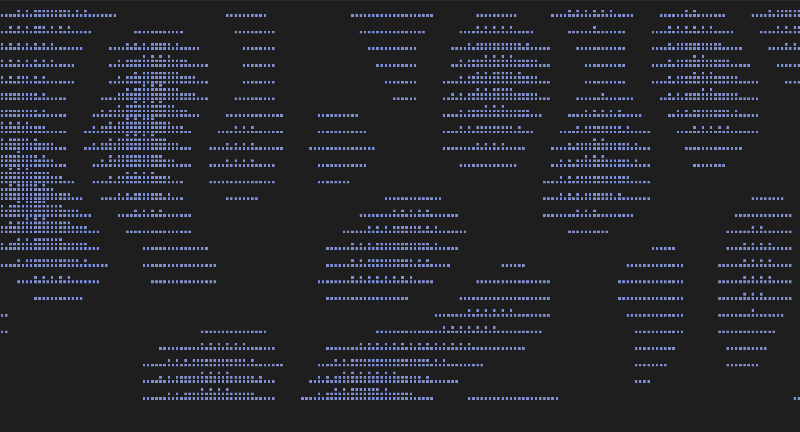
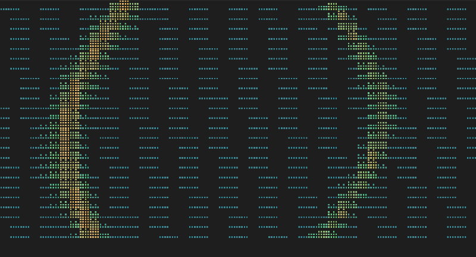

# Анимации

[HEID//R](../../README.md) · [Документация](README.md) · [English](../en/animations.md)

## Что это такое

Анимация — это отрисовщик: функция от размера кадра и его номера, которая
возвращает строки для показа. Больше в ней ничего нет.

```python
@animation("life", glyphs="blocks", fps=8)
def paint(frame: Frame) -> list[str]:
    ...
```

Кадр несёт всё, что отрисовщику позволено знать: `width`, `height`, `tick`,
набор символов `ramp`, уровень глифов терминала и последнее событие в `payload`.
Геометрия приходит с каждым кадром и нигде не запоминается — поэтому терминал
можно менять в размере прямо посреди съёма, и съём этого не заметит.

Отрисовщик, который не смотрит в `payload`, рисует фон. Тот, который его читает,
рисует данные. Вся разница на этом и заканчивается: водопад и игра «Жизнь» —
объекты одного рода.

Если между кадрами нужно что-то помнить, отрисовщик пишется классом с методом
`paint`, а не функцией. Вторая половина — метод `feed`: холст передаёт в него
каждое событие того имени, которое анимация объявила.

## Как добавить свою

Один файл в `heidr/visuals/art/`, одна функция или класс, один декоратор. Ядро
при этом не правится — ровно как с модулем-источником.

Уровень глифов объявляйте честно. Анимация, которой нужен брайль, в голой
консоли просто не будет выбрана, и это правильное поведение, а не сбой.

Прежде чем писать новую, поищите готовую. Терминальная графика — поле хоженое, и
трудную часть обычно уже сделали лучше. Позаимствовать и назвать автора в
`credits.md` лучше, чем написать здесь версию похуже.

## Уровни глифов

Каждая анимация объявляет самый бедный терминал, на котором ещё жива: `ascii`,
`box`, `blocks` или `braille`.

Одно и то же имя регистрируется несколько раз на разных уровнях, а реестр отдаёт
самый богатый вариант, который этот терминал нарисует. В современном эмуляторе
водопад рисуется брайлевскими ячейками, в голой консоли — блоками, а там, где
нет ни того ни другого, — набором `.:-=+*#%@`.

Выбирать и настраивать ничего не нужно. Разница между тремя водопадами — одна
строка с именем набора символов, всё остальное у них общее.

## Цвет

Раньше вся анимация рисовалась одним цветом, и плазменное поле, шестерни и
падающие глифы были того же оранжевого, что и логотип над ними. Теперь у каждой
анимации цвет свой, причём предлагается несколько, а один вытягивается при
запуске: сегодня шестерни бирюзовые, завтра латунные.

Таблица живёт в `heidr/visuals/palette.py`, и правила, по которым она собрана,
стоит держать в голове.

Анимация — это **фон**. Поверх неё стоят панель и логотип, поэтому каждый цвет
держится темнее панельного текста и умеренным по насыщенности. Чистый
спектральный цвет на тёмном фоне дрожит и читается как заставка, а не как
прибор; большое красное поле читается как ошибка. Ни того ни другого в таблице
нет, и оба запрета проверяются тестом.

Цвет идёт от предмета, а не украшает его. Радарный зелёный — единственный цвет,
каким когда-либо был экран радара. Библиотека пергаментная. Печать — киноварь, а
камень под ней — нефрит. Молчание того же серого, каким набран лозунг. Там, где
анимация подражает настоящему прибору, решает прибор.

Цвет понижается вместе с терминалом ровно так же, как акцент: шестнадцатеричное
значение там, где цветов шестнадцать миллионов, ближайший индекс xterm там, где
их 256, и **никакого цвета ниже этого**. Тема голой консоли — белое на чёрном с
инверсией, и подкрашивать её значило бы испортить единственное, что она делает
хорошо.

Две анимации из этого исключены и остаются акцентными. `seeress` — логотип самой
программы, `reveal` — ответ, и оранжевый принадлежит им.

### Окраска по уровню

Три анимации рисуют измеренное, и они окрашены не ровным цветом, а по величине:
водопад идёт от холодного шумового пола к горячей несущей, осциллограф — от
тусклого луча к яркому, сейсмограф — от спокойного сланцевого к неистовому
глиняному. Именно так ведут себя приборы, которым они подражают, и именно
поэтому спектр читается с одного взгляда.

Для них холст возвращает `rich.text.Text`, для всего остального — обычную
строку. Цвет выбирается по месту символа в наборе, а соседние символы, попавшие
на один цвет, делят один отрезок, так что строка обходится десятками отрезков, а
не одним на клетку. Собирается именно `Text`, а не разметка: отрисовщик вправе
нарисовать квадратную скобку, а разметка приняла бы её за тег.

Там, где у терминала всего 256 цветов, опорные точки берутся как есть: один
индекс xterm с другим не смешать.

## Кто какую приводит с собой

Модуль называет свою анимацию в том же поле `visual`, которое у него было
всегда, и анимация меняется, когда начинается его стадия. Модулю, который не
назвал ничего, случайно выдаётся одна из фоновых, чтобы на каждом шаге было на
что смотреть, а не только на именованных.

| Анимация | Для кого | Что это |
|---|---|---|
| `plasma` | `blind`, простой | Четыре синусоиды, расходящиеся из четырёх точек |
| `life` | простой | Правила Конвея, засеянные измеренной энтропией |
| `rule30` | простой | Правило Вольфрама: по строке за кадр, всё уползает вверх |
| `rings` | простой | Круги, расходящиеся от четырёх капель по стоячей воде |
| `runes` | простой | Старший футарк, поднимающийся и гаснущий |
| `rain` | простой | Падающие столбцы глифов |
| `starfield` | `planetary`, простой | Звёзды с параллаксом |
| `moon` | `moment`, `calendar`, простой | Фаза луны, растущая вместе с терминалом |
| `seeress` | поле вопроса | Хейд: дышит, моргает, с посохом в руке |
| `waterfall` | `fm_voice`, `mw_voice`, `sw_voice` | Бегущий спектр |
| `globe` | `net_voice` | Проволочный глобус, и на нём отметки станций |
| `relay` | `kiwi_voice` | Чужая мачта на горизонте и волны, которые она слышит |
| `scanlines` | `twitch_voice` | Стеклянный экран, на котором картинка не встала |
| `scope` | `ism`, `rtl_peak` | Живая осциллограмма |
| `radar` | `sky`, `adsb_local` | Развёртка и отметка на ней |
| `seismo` | `quake` | Лента сейсмографа |
| `hexlib` | `babel` | Стена шестиугольников и падающие сквозь неё буквы |
| `codepage` | `mojibake` | Страница, перечитанная в одной неверной кодировке за другой |
| `bits` | `sdr_noise` | Дождь из битов; пары гасят друг друга, уцелевшие складываются в дайджест |
| `sieve` | `skeleton` | Слова трясут, пока из них не высыплются гласные |
| `zipf` | `rarest` | Частотная гистограмма схлопывается до столбца, которого никто не говорит |
| `initials` | `acrostic` | Первые буквы поднимаются из стопки слов и выстраиваются в ряд |
| `abacus` | `gematria` | Буквы падают на костяшки, а под ними растёт сумма |
| `chain` | `chain` | Блоки, вдоль которых бежит хэш |
| `dish` | `apt`, `hline` | Тарелка и поднимающийся под ней шумовой пол |
| `cog` | всё, что не назвало своей анимации | Ряд сцепленных шестерён |
| `mirror` | `reversal` | Вопрос входит в ось с одной стороны, а с другой выходит его противоположность |
| `lattice` | `embed` | Облако точек оседает на одно направление |
| `vapour` | `pythia` | Пар, поднимающийся от треножника |
| `hush` | `mute` | Толкование, которое ничего не выдаёт |
| `hexagram` | `iching` | Шесть линий, растущих снизу вверх |
| `cards` | `tarot` | Переворачивающаяся карта |
| `scissors` | `cutup`, `oblique` | Разрезанный и разлетающийся текст |
| `reveal` | ответ | Толкование, проступающее из шума |

Про шестерни стоит сказать отдельно: это не индикатор выполнения. Механизм
ничего не знает о том, насколько близок ответ. Он сообщает только, что работа
идёт, — ровно столько, сколько честно сказать.

### Каждая стадия длится не меньше трёх секунд

Анимацию, которую никто не увидел, не стоило и рисовать. Часть модулей
укладывается в миллисекунды, поэтому ответивший модуль придерживает свой слот,
пока с момента его запуска не пройдёт три секунды; более медленный не
задерживается вовсе. Правило живёт в самом прогоне, а не в анимациях, и
подробнее описано в
[устройстве программы](architecture.md#и-слишком-быстро-тоже-не-годится).

### Молчание может быть смешным

`hush` — не одна картинка, а набор, и какую показать, решает случай. Толкование
не выдало ни строки, и это единственное место, где программе позволено
пошутить: ответа всё равно нет, терять нечего.

В наборе есть и серьёзная фигура с пальцем у губ, и совершенно несерьёзное
пожатие плечами `¯\_(ツ)_/¯`. Лестница глифов действует и здесь: `ツ` — это
катакана, которой в консольном шрифте обычно нет, поэтому та же поза существует
и в чистом ASCII для бедных терминалов.

Больше нигде такого тона нет. Шутка принадлежит только пустому ответу, а
настоящий ответ показывается без всего этого.

## Как их записывают

`tools/make_demo.py` пишет зацикленные ролики в `docs/demo/`.

```
python tools/make_demo.py            все ролики из таблицы
python tools/make_demo.py plasma     один из них
```

<p align="center">
  
  
</p>

Экран здесь никто не снимает. Интерфейс запускается вслепую, номер кадра
выставляется руками, а не отдаётся таймеру, и каждый кадр выгружается как SVG
настоящего дерева виджетов — той же выгрузкой пользуются снимочные тесты. Дальше
`resvg` растрирует кадры именованным моноширинным шрифтом, а `ffmpeg` их
кодирует.

Ради этого всё и затевалось вместо экранной записи или проигрывателя терминала.
Отрисовщик — функция от номера кадра, поэтому кадр N остаётся кадром N на любой
машине, а петля замыкается выбором числа кадров, а не подрезанием записи до тех
пор, пока стык не перестанет быть заметен. Тест, который это гарантирует, в
наборе уже есть: анимация, перерисованная на том же тике, обязана не измениться.

Две вещи всё же приходится закрепить, иначе о воспроизводимости говорить нечего.
Часть отрисовщиков заводит генератор случайных чисел на первом кадре —
инструмент подсовывает им засеянный. И Rich называет в выгрузке шрифт, которого
почти ни у кого нет, — инструмент называет семейство сам, вместо того чтобы
полагаться на догадку.

Два ролика — не анимация, а целый прогон: `draw-radio` и `draw-pythia`. Они
проигрываются по шагам из таблицы в начале инструмента. Каждое поле, которое
выставляет сценарий, выставляет и настоящий прогон, и каждое событие, которое
сценарий шлёт, шлёт и настоящий прогон, так что интерфейс работает сам, а не
срисовывается; из таблицы берутся материал и ответ — то, чего запись не может
пойти и добыть заново.

На выходе получается анимированный WebP без потерь, а для того ролика, что стоит
на первой странице, ещё и GIF. WebP примерно втрое легче и оставляет края глифов
ровно там, где они нарисованы, — а это ровно то, что портит кодек с потерями. В
GIF идёт палитра, взвешенная по движущимся пикселям, и упорядоченный дизеринг,
который не переезжает между кадрами: дизеринг по умолчанию ползёт, и экран,
полный брайлевских точек, начинает кипеть.

## Где всё это рисуется

Анимация занимает весь терминал. Текст лежит поверх неё в панели, которая
отцентрована и растянута по своему содержимому, и у панели есть собственный
непрозрачный фон, чтобы анимация за ней никогда не мешала читать.

**Больше ничто не имеет права закрывать холст.** Виджет поверх него прячет
символы холста, даже если сам полностью прозрачен: композитор отдаёт клетку
тому, кто выше, а смешивание цветов нижние символы не возвращает. Контейнер во
всю ширину над холстом — это ровно то же самое, что отсутствие анимации. Именно
так здесь однажды и случилось, и держалось долго, пока все тесты про размеры и
таблицы стилей оставались зелёными.

Тест, который это ловит, собирает экран композитором и ищет в углах символы
`plasma` — той анимации, которая заполняет каждую клетку. Только такое
доказательство здесь чего-то стоит: то, что терминал действительно получил бы.

Отсюда ещё два следствия. Отрисовщику отдаётся весь экран, поэтому луна или ряд
шестерён растут вместе с окном. А панель ограничена девяноста процентами ширины
и переносит свой текст, поэтому закрыть собой всё она не может никогда.

## Панель

Прогон показывается размеченными блоками, а не одним сплошным полотном текста:

```
· gematria  //  · babel  //  ▸ pythia

question · 00012
  Что мне делать?

found · bitcoin/914233
  !lzz(5<Sq_Ewq> CORE|u& fmBN ,KT2+ 0 EXSAT sysB
  … ещё 180 символов

answer · pythia
  Ешь то, что не выбирал.
```

Всё складывается по ширине панели. Раньше строка в триста символов обрезалась по
краю, и остаток просто пропадал с экрана, ничем себя не обозначив. Материал
ограничен десятью строками и сообщает, сколько осталось за кадром; целиком он
всегда лежит в журнале.

Материал появляется, как только источник его отдал, — по событию `found`, а не
когда закончится весь прогон. Толкование через языковую модель занимает
полминуты, и смотреть эти полминуты в пустоту незачем.

Сообщение, которым закончился прогон, пишется в панель с восклицательным знаком
акцентного цвета и повторяется в нижней строке: отказ, сбой или толкование, не
выдавшее ни строки. Мелочь вроде изменённой настройки остаётся только внизу.

## Поле вопроса

Вопрос открывает отдельный вид: Хейд слева, рамка с вопросом справа и одна
строка под рамкой о том, что делают клавиши. Нижняя строка при открытой рамке
молчит: одни и те же слова в двух местах читаются как два разных сообщения.

Фигура — это обычный текст внутри панели, а не отрисовщик за ней, поэтому её
двигает собственный таймер трижды в секунду. Она моргает, навершие посоха
разгорается, подол плаща качается — и больше ничего.

Ниже семидесяти четырёх колонок фигуру убирают, а поле остаётся: половина фигуры
рядом с половиной поля не поможет никому.

Её приметы — глаза, рот, навершие посоха, подол — находятся в самом рисунке при
импорте, а не записаны координатами. Однажды рисунок поправили, а координаты нет,
и лицо у неё вышло перекошенным.

## Полоса стадий

В прогоне три слота, и панель показывает их сверху:

```
· gematria  //  ▸ babel  //    ...
```

Отработавший слот помечен точкой, на работающий указывает стрелка, а слот, до
которого прогон ещё не дошёл, называется `...`. Стадии узнаются по одной, из тех
же событий, которые меняют анимацию, — поэтому полоса не может показать модуль
раньше, чем он на самом деле выбран.

## Логотип и лозунг

Логотип белый, косые в нём оранжевые, и этот оранжевый не берёт себе ничто в
программе, кроме ответа. Оттенок понижается вслед за терминалом: `#e08b1e` там,
где цветов шестнадцать миллионов, индекс 214 палитры xterm — там, где их 256, и
обычный жёлтый ниже этого. У анимации за логотипом [свой цвет](#цвет), и с
логотипом она его не делит.

Под логотипом выпадает лозунг, один из дюжины. Одна запись в этом наборе — не
лозунг, а эффект: буквы меняются три раза в секунду, а очертания слов остаются
на месте, как у обфусцированного текста в Minecraft.

Эта запись попадает в набор только при трёх условиях. Терминал должен рисовать
блочные глифы, иначе случайный Unicode превратится в пустые квадраты. `TERM` не
должен быть `dumb`. И `ui.motion` должен быть включён, потому что мерцающий
текст — вещь, на которую часть людей физически не может смотреть. Не выполнено
хоть одно — эффекта в наборе просто нет, ровно так же, как нет радиомодуля без
воткнутого донгла.

## Заголовок окна

Заголовок — единственное, что видно, когда не видно самого окна. Во время
прогона он выглядит так:

```
⠹ HEID//R — fm_voice 2/4
```

Сначала вертушка, потом логотип, потом работающий модуль и то, как далеко он
продвинулся. Между прогонами остаётся один логотип, без висящих тире и нулей, а
на выходе программа возвращает заголовок как было, чтобы в списке окон ничего не
осталось крутиться.

Вертушка брайлевская там, где терминал рисует брайль, и `|/-\` там, где не
рисует. Прогресс приходит событием `progress` с парой «сделано — всего».
Отправляет его развёртка по диапазону, потому что это самое долгое, что
программа делает; модуль, который не отправляет ничего, показывает вместо этого
стадию прогона, `2/3`. Придумать проценты для работы, которая сама себя измерить
не может, было бы хуже, чем промолчать.

`App.title` тоже выставляется, а управляющая последовательность пишется
напрямую, потому что голая консоль молча игнорирует то, чего не понимает.

## Потоки

Съём идёт в рабочих потоках, а трогать виджет можно только из того потока, где
живёт интерфейс. Поэтому события шины проходят через `call_from_thread`, когда
приходят откуда-то ещё, и напрямую, когда не приходят.

Модулю знать об этом не нужно. Он вызывает `ctx.emit` и работает дальше.

## Источники

Плазменное поле и вращающаяся шестерня взяты из
[asciimatics](https://github.com/peterbrittain/asciimatics) Питера Бриттена,
Apache-2.0.

Регистр экрана прослушивания — бегущий по терминалу ASCII-спектр — из
[retrogram-rtlsdr](https://github.com/r4d10n/retrogram-rtlsdr) от r4d10n.

Механика проявления текста — из
[no-more-secrets](https://github.com/bartobri/no-more-secrets) Брайана Барто,
GPL-3.0.

Падающие столбцы следуют за [cmatrix](https://github.com/abishekvashok/cmatrix)
Абишека В. Ашока, GPL-3.0.

Правила игры «Жизнь» принадлежат Джону Конвею, 1970, и менять их не нам.

Мерцающий лозунг повторяет регистр обфусцированного текста в Minecraft.

Сама Хейд, карты, тарелка и шестерни нарисованы для этого проекта. Каомодзи
вроде `¯\_(ツ)_/¯` — фольклор без внятного авторства, и берутся они как есть;
всё, у чего автор есть, было бы названо здесь наравне с остальным.
